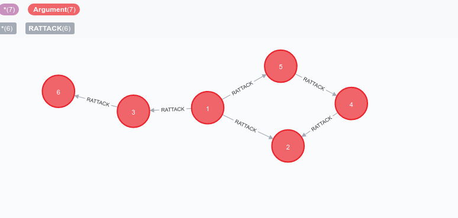
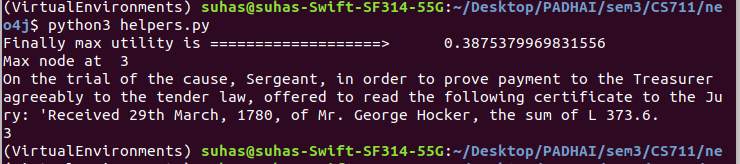

# AI Lawyer
Debater chat app with websockets using Node.js, Express and Socket.io with Vanilla JS on the frontend with a custom UI. Used framework from
[https://repl.it/badge/github/bradtraversy/chatcord](https://repl.it/github/bradtraversy/chatcord) and [https://github.com/agent-q1/AI-Debater](https://github.com/agent-q1/AI-Debater) 
## Usage
```
npm install
npm run dev

Go to localhost:3000
```
Have a fun debate about flat earths

# Other Details 
## Table of contents
* [General info](#general-info)
* [Technologies](#technologies)
* [Setup](#setup)

## General info
This is a project for the course CS711 that aims to build an AI lawyer using concepts of Game Theory and Mechanism Design. We first use NLP (on data from previous law cases) to find the relations between arguments i.e. how strongly a particular argument attacks another argument and construct an argumentation framework with it. When the opponent gives a particular argument, we find the most optimal argument that attacks that particular node. Our criteria for choosing the most optimal node is based on how strong the argument is, how likely the oponent will be able to provide a counter argument to it and how strong that argument could possibly be. We try to look at the possible states that the game could go to over the next *d* moves and try to predict the node with the maximum utility. More details can be found in our paper [ArgumentationTheory.pdf](https://agent-q1.github.io/docs/ArgumentationTheory.pdf) 
	
## Technologies
Project is created with:
* Neo4j: 4.1
* Python: 3.6
* Neo4j Python driver: 4.2
	
## Setup
To run this project, first move the csv files into the import folder that you neo4j database looks for. Start up the database. Change the password in test.py to the password of the database. It is recommended to use virtual environments.

```
$ pip install neo4j==4.2.0
$ python3 helpers.py
```

You should now be able to view the various nodes and relationships in your neo4j browser when you run the command
```
MATCH (a:Argument)
RETURN a
```



This is a small test example (which can be easily swapped out for real data) to allow us to see how the working of the algorithm. 

Running `find_next_argument()` on the current graph with a `depth = 2` on node 1 yields Node 3 as the next argument. 


